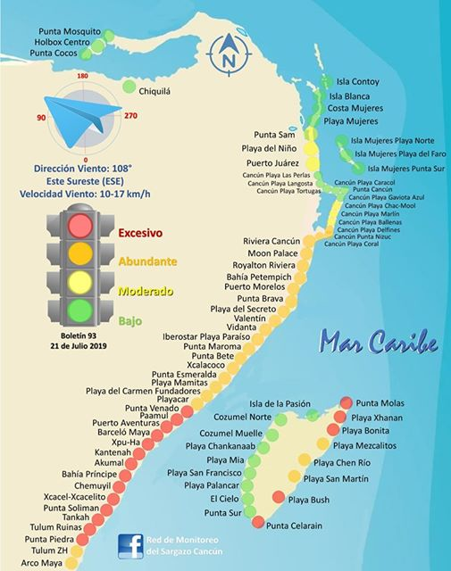
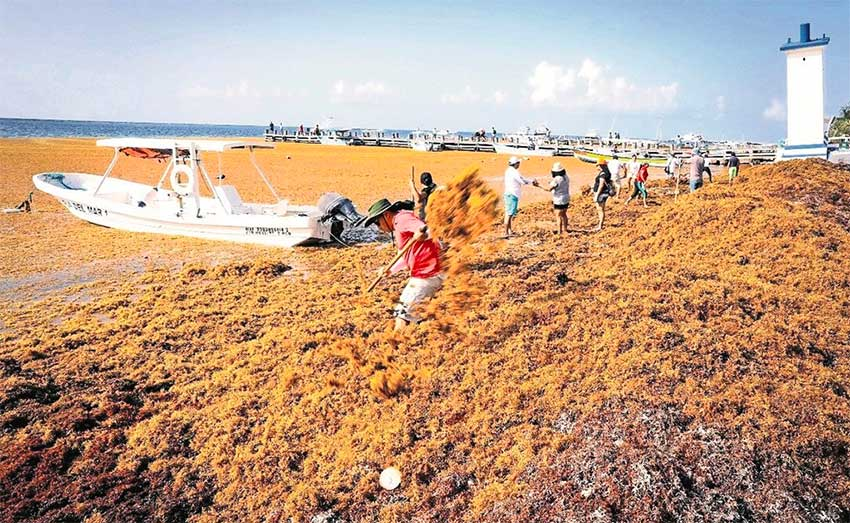
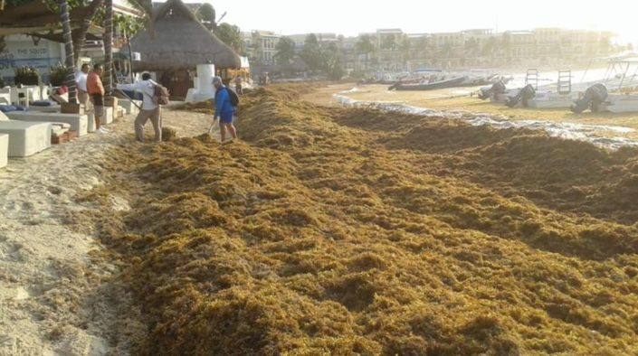
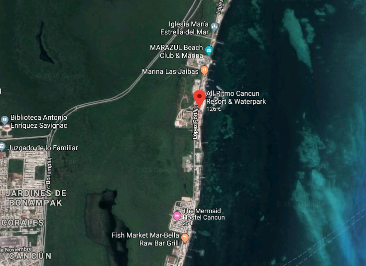
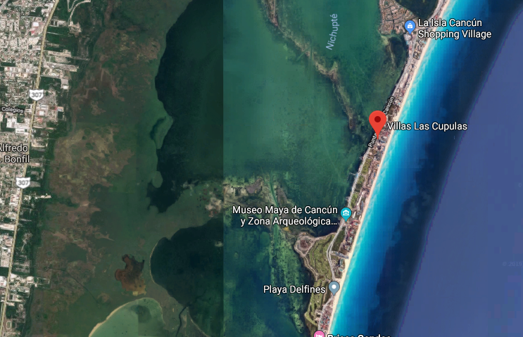
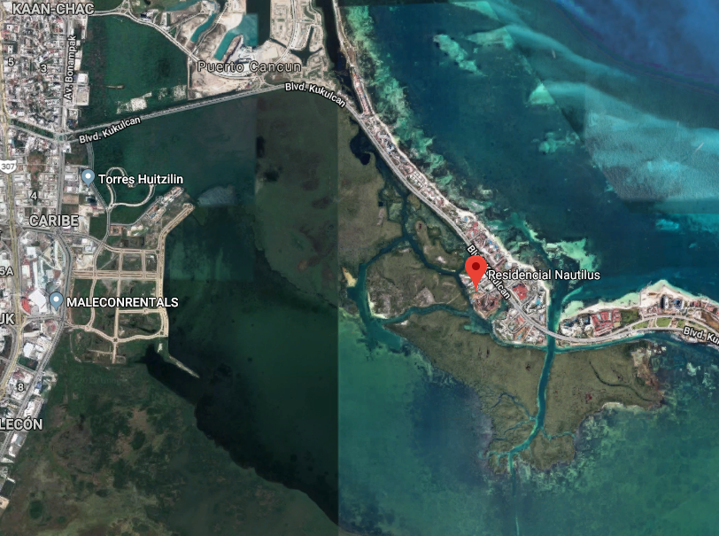

# Cancun 2020

Hallo ihr Lieben. Ihr werdet hier alle Informationen und Optionen zu unserer Cancun Reise '20 finden.

## Reisende / Gruppen

### Familie Belch

- Antje
- Thomas

### Familie Belch Garcia

- Amelie
- Cynthia
- Mila
- Tobias

### Familie Garcia Zermeno - **Bleiben nur für eine Woche!**

- Blanca
- Gerardo

### Theresa und Jenny

- Jenny
- Theresa

### Familie Sarkander

- Carsten
- Katrin

## Die Algen

Da es seit einem Jahr oder so [extreme Algenprobleme](https://www.nzz.ch/international/mexikos-traumstraende-unter-algen-begraben-ld.1495719) an den Stränden Mexikos gibt, wird die Wahl der Lage sehr durch die Nähe zu den richtigen Stränden bestimmt.

Hier wird die Algensituation der Regionen von _exzessiv_ (excesivo) bis _wenig_ (bajo) eingestuft. Man kann gut erkennen, dass die Region um Playa del Carmen besonders stark betroffen ist und das es für die Region nördlich von Cancun und Inseln am besten aussieht. Die Algen werden an den Stränden täglich entfernt, aber die Hotels scheinen machtlos. Hier zwei aktuelle Foto von Playa del Carmen:

  
  

**Aus diesem Grund haben wir jetzt nur nach Unterkünften im nördlichen Bereich von Cancun gesucht.**

## Unterkünfte

Die Preise gelten immer für **12 Personen (10 Erwachsene, 1 Kind, 1 Baby)** und den Zeitraum **29.02.2020 - 13.03.2020**! Zusätzlich habe ich sie pro Nacht und Gruppe berechnet, um einen besseren Eindruck von den Kosten zu haben. Aufgelistet sind die Unterkünfte in der Reihenfolge in der wir sie gefunden haben.

### All Ritmo Cancun

#### 2.994,- € | 46€ pro Nacht und Gruppe

#### Pro

- direkt am Strand
- Hotelinfrastrukur
- Pool
- Wasserpark
- Frühstück möglich

#### Kontra

- Betten sind auf wenige Zimmer aufgeteilt
- etwas wenig Infrastruktur (abseits vom Hotelkomplex)
- Fahrtkosten zu Sehenswürdigkeiten könnten im Vergleich etwas höher sein

#### Beschreibung

Hierbei handelt es sich um ein Penthouse, welches zu einem [Hotelkomplex](https://www.allritmocancun.com/en/galeria/) gehört, wir aber über [airbnb](https://www.airbnb.de/rooms/30560817?location=Canc%C3%BAn%2C%20Mexiko&adults=10&children=2&check_in=2020-02-29&check_out=2020-03-13&source_impression_id=p3_1564205798_WGMMT0FXvskewmMB&guests=12&sl_alternate_dates_exclusion=true) buchen könnten.

Das schöne hier, es gibt einen kleinen Wasserpark, wir sind direkt am Strand, es gibt einen Pool mit Bar und Restaurants als Teil der Hotelinfrastruktur, die wie, teilweise umsonst, teilweise gegen Gebühr, nutzen können. Auch Frühstück könnte man buchen. Das Hotel liegt etwas abgelegen, wodurch es sehr ruhig, aber auch etwas entfernt von sonstiger Infrastruktur ist. Wenn man am Strand entlag läuft, findet man ein paar Fischrestaurants. Für Supermärkte und andere Restaurants müssten wir vermutlich ein Taxi nehmen.

### Grand Villa Cancun

#### 4.213,- € | 65€ pro Nacht und Gruppe

#### Pro

- wenige Meter zum Strand
- direkt in der Hotelgegend = Restaurant und Einkaufsmöglichkeiten
- Pool
- viele Zimmer

#### Kontra

- könnte recht laut sein

#### Beschreibung

Auch über [airbnb](https://www.airbnb.de/rooms/24454587?location=Canc%C3%BAn%2C%20Mexiko&adults=10&children=2&check_in=2020-02-29&check_out=2020-03-13&source_impression_id=p3_1564209566_2cYEdQ8Jc1FdFsbt&guests=12&sl_alternate_dates_exclusion=true) kann diese Villa gebucht werden, die Teil eines Appartementkomplexes ist. Es gibt einen Pool, 5 Schlafzimmer, die Anlage befindet sich in der Hotelgegend und ist nur wenige Meter vom Strand entfernt. Aufgrund der Lage gibt es hier mehr Infrastruktur, als bei All Ritmo Cancun. Man liest, dass die Nähe zum Hardrock Hotel für etwas Lärm sorgen kann. Orte zum Ausgehen, NAchtclubs etc., sind nicht weit entfernt

### Casa en la zona hotelera frente a la Laguna

#### 3.135,- € | 48€ pro Nacht und Gruppe

#### Pro

- wenige Meter zum Strand
- direkt in der Hotelgegend = Restaurant und Einkaufsmöglichkeiten
- Pool im Komplex
- privater Pool
- ruhig
- gute Anbindung mit Bus
- Zugang zur Lagune

#### Beschreibung

Auch in der Hotelgegend - wennauch etwas ruhiger, als die Grand Villa - liegt diese Villa, als Teil eines Appartmentkomplexes. Auch hier würden wir wieder über [airbnb](https://www.airbnb.de/rooms/22980658?location=Canc%C3%BAn%2C%20Mexiko&adults=10&children=1&check_in=2020-02-29&check_out=2020-03-13&source_impression_id=p3_1564211732_4pXpCx7AeRPnQ9kq&guests=11&infants=1&sl_alternate_dates_exclusion=true) buchen. Das Schöne ist, dass wir neben einem privaten Pool auch direkten Zugang zu der Lagune haben, in der wir mit Kajaks paddeln können. Auch hier finden wir eine gute Infrastruktur und sogar eine sehr gute Anbindung mit dem Bus, um Nachtclubs etc. zu erreichen.

